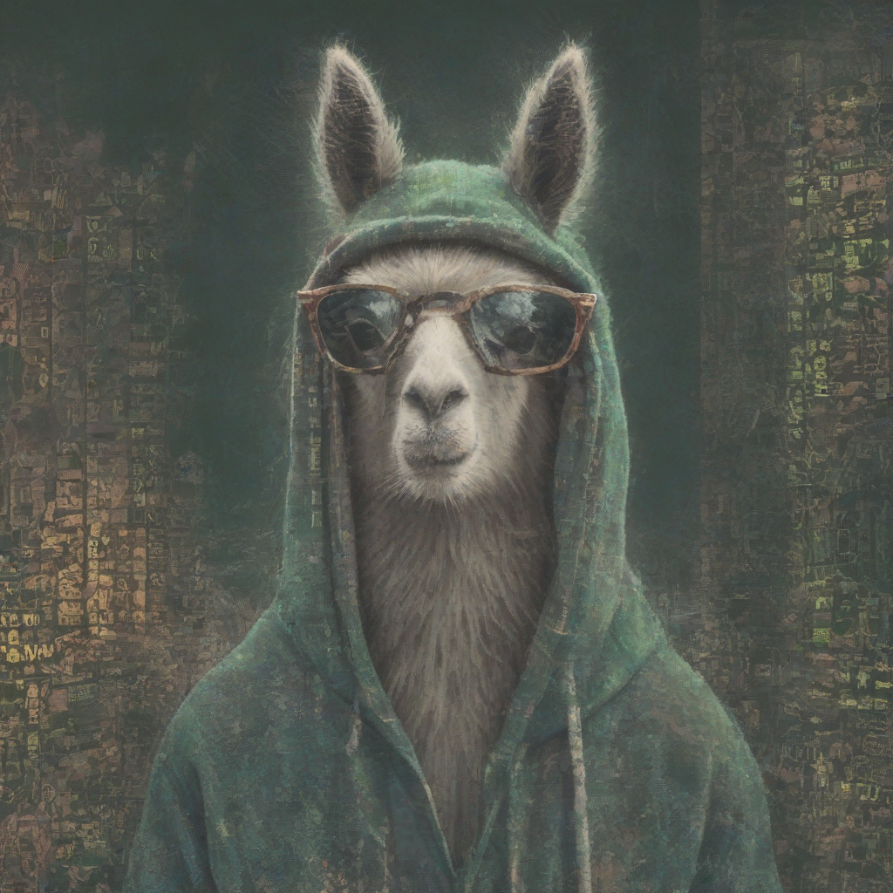

# OmniLlama CODER



## Descrição

O Chatbot Canvas é uma interface gráfica desenvolvida em Python utilizando PyQt5, que permite interagir com um chatbot para gerar e modificar código. O projeto integra um modelo de linguagem para processar consultas do usuário e fornecer soluções de código, além de manter um histórico de chat e permitir a edição de código em tempo real.

## Funcionalidades

- **Interface Gráfica**: Uma interface amigável com áreas separadas para chat e edição de código.
- **Processamento de Consultas**: O chatbot processa as consultas do usuário e gera respostas utilizando um modelo de linguagem.
- **Edição de Código**: Permite ao usuário editar código diretamente na interface, com suporte a destaque de sintaxe.
- **Histórico de Chat**: Mantém um histórico das interações do usuário com o chatbot.
- **Salvar e Carregar Sessões**: O usuário pode salvar o estado atual do chat e do código em arquivos JSON e carregá-los posteriormente.
- **Funcionalidade de Desfazer e Refazer**: O usuário pode desfazer e refazer alterações feitas no código.

## Tecnologias Utilizadas

- **Python**: Linguagem de programação principal.
- **PyQt5**: Biblioteca para criação da interface gráfica.
- **Markdown**: Para formatação de texto no chat.
- **LangChain**: Para integração com modelos de linguagem e gerenciamento de vetores.

## Instalação

1. Clone o repositório:
   ```bash
   git clone <URL_DO_REPOSITORIO>
   cd <NOME_DO_REPOSITORIO>
   ```

2. Instale as dependências:
   ```bash
   pip install -r requirements.txt
   ```

3. Execute o aplicativo:
   ```bash
   python canvas.py
   ```

## Uso

- Inicie o aplicativo e interaja com o chatbot digitando suas consultas na área de entrada.
- O chatbot responderá com soluções de código que podem ser editadas na área de edição de código.
- Utilize os botões de salvar e carregar para gerenciar suas sessões de trabalho.

## Contribuição

Contribuições são bem-vindas! Sinta-se à vontade para abrir issues ou pull requests.

## Licença

Este projeto está licenciado sob a MIT License. Veja o arquivo [LICENSE](LICENSE) para mais detalhes.